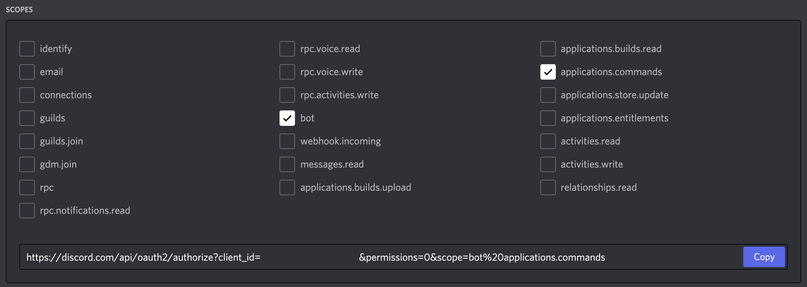
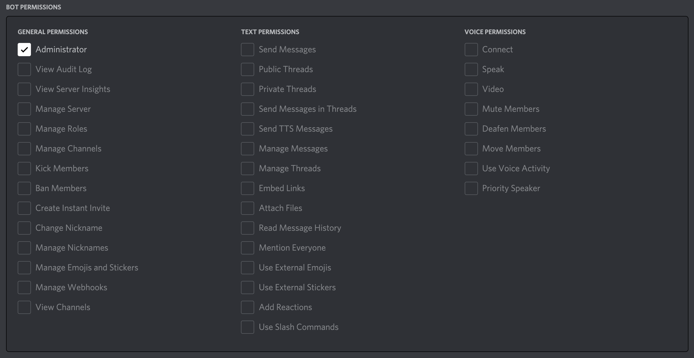

# discord-bot

## Running the code

Install
```
npm install
```


Run in production mode
```
npm start
```


Run in development mode
```
npm run dev
```


## Inviting a bot to your server

To add the bot to you Discord server follow the steps below.
1. Log in to the Discord developer portal and select your bot.
2. Go to the OAuth2 menu.
3. Select the scopes shown below.
   
4. Select the permissions shown below.
   
5. Copy the URL in the scopes box and navigate to it.
6. Select the server you want to add your bot to and follow all the prompts.