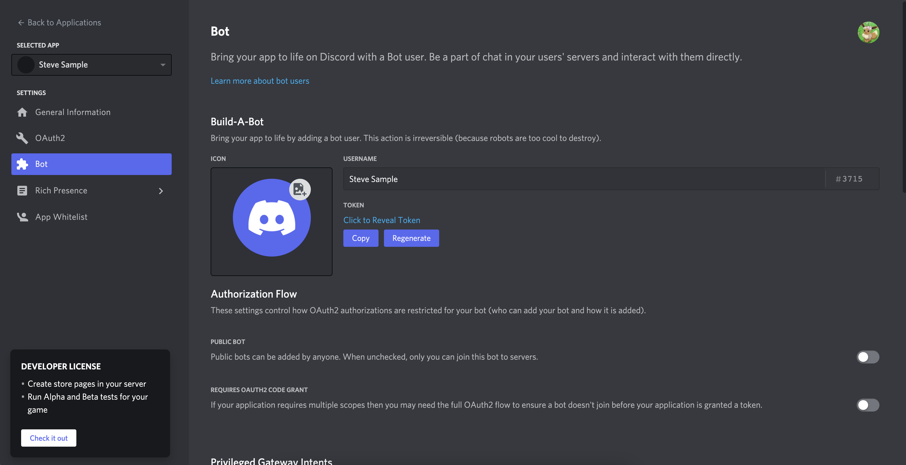

# steve-bot

Steve is a multipurpose Discord bot. He is able to play music, act as a soundboard, send messages in a channel and simulate opening CS-GO containers.

This document describes how you can get edit Steve and get him up and running in your own Discord server. I have assumed that you may want to edit some of his code base so we're going to cover how to run him locally on your computer as well as running him in the Cloud.

## Table of contents

1. [Table of contents](#table-of-contents)
2. [Prerequisites](#prerequisites)
3. [Creating a bot application](#creating-a-bot-application)
4. [Inviting a bot to your server](#inviting-a-bot-to-your-server)
5. [Running Steve's code](#running-steves-code)
   1. [Set up](#set-up)
   2. [Deployment of slash commands](#deployment-of-slash-commands)
   3. [Running Steve locally](#running-steve-locally)
   4. [Running Steve on the Cloud](#running-steve-on-the-cloud)

<a name="prerequisites"></a>
## Prerequisites

Before we begin make sure you have the following installed:

1. [Node.js](https://nodejs.org/en/) v16.6.0 or higher and npm (but that comes with Node.js)
2. [Git](https://git-scm.com/downloads) - you can skip this if you would rather download the repository straight from GitHub
3. [Visual Studio Code](https://code.visualstudio.com/download) or another text editor

You will also need a [Discord](https://discord.com/app) account.

All commands mentioned in this tutorial should be run from the Terminal on Mac. You can also run them from the Command Prompt on Windows however some of the commands may need to be updated.


<a name="creating-a-bot-application"></a>
## Creating a bot application

To get Steve in your Discord server you need to start by creating a bot application in the Discord developer portal. Follow the steps below to do this.

1. Go to the [Discord developer portal](https://discord.com/developers/docs/intro) and log in.
2. Navigate to "Applications" in the left hand panel.
3. Click "New Application" in the top right corner, give your application a name and click "Create".
4. Navigate to "Bot" in the left hand panel.
5. Click "Add Bot" and confirm the pop up.
6. Note down the token from this page - be careful not to share this token with anyone, it's basically like a password so that code can run on you bot. If you want to know more information about the token read [this](https://discordjs.guide/preparations/setting-up-a-bot-application.html#your-token).
7. If you like, give Steve a custom avatar on this page.
8. I also set the "Public Bot" setting to off so that only I can invite him to servers.




<a name="inviting-a-bot-to-your-server"></a>
## Inviting a bot to your server

Now that you've created a bot application you'll want to invite it to your Discord server. To add the bot to your Discord server follow the steps below.

1. Navigate to "OAuth2" in the left hand panel.
3. Select the `bot` and `applications.commands` scopes as shown below. This will allow Steve to be a bot and update slash commands.
   
4. Select the `Administrator` permission as shown below. I haven't gone through the code yet and fleshed out which exact permissions are needed so just gave Steve access to everything. Perhaps I'll go through the list and update this one day.
   
5. Copy the URL in the scopes box and navigate to it. This URL is an invite link for you bot based on the scopes and permissions selected.
6. Select the server you want to add your bot to and follow all the prompts.

You should now see your bot as a member in your Discord server. We are now ready to get Steve's code up and running.


<a name="running-steves-code"></a>
## Running Steve's code

For Steve to actually run and act as a bot you need to run his code. You have two options to do this - running the code locally on your computer or running the code on a server. If the code is not running Steve will not do anything.

In addition to running the code you will need to deploy the slash commands to your Discord server. We are going to do this from your computer.

<a name="set-up"></a>
### Set up

1. Pull the repository from GitHub (or download it using the website).
   ```bash
   git pull https://github.com/gazelle51/steve-bot.git
   ```
2. Navigate into the folder.
   ```bash
   cd steve-bot
   ```
3. Install all dependencies.
   ```bash
   npm install
   ```
4. Duplicate the `.sample-env` file and rename it `.env`. This file is going to contain all sensitive information (such as the token from before). Do not share this file with anyone and do not upload it to the web.
   ```bash
   cp .sample-env .env
   ```
5. Edit the newly created `.env` file using your text editor and update all the values.


<a name="deployment-of-slash-commands"></a>
### Deployment of slash commands

Slash commands need to be deployed before they are registered by your bot. You can deploy the slash commands to a single Discord server or to your bot globally. Two scripts have been provided to perform both of these tasks. If you decide to deploy the slash commands to a single Discord server ensure that the `GUILD_ID` environment variable in the `.env` file is correct.

To deploy to a single server use the command below. This will update instantly.
```bash
npm run deploy-guild
```

To deploy the slash commands globally use the command below. It could take up to one hour for these changes to take effect.
```bash
npm run deploy-global
```

It is recommened to only deploy to a single Discord server while you are developing. Otherwise deploy the slash commands globally as this will ensure all servers using your bot are up to date. 


<a name="running-steve-locally"></a>
### Running Steve locally

Now that you are all set up and have Steve's slash commands deployed you can run his code. We are now going to go through how you can run Steve's code locally on your computer. If you decide to do this, the bot will only work when you have the code running.

Since the repository is already downloaded, dependencies are installed and the environment variables are updated you just need to run the command below to get the code going.

```bash
npm start
```

Alternatively, you can run the code in development mode. This is handy when you're developing as the application will restart every time you save changes to one of the files in the code base.
```bash
npm run dev
```


<a name="running-steve-on-the-cloud"></a>
### Running Steve on the Cloud

If you want Steve to work 24/7 and you don't want to leave your computer on you will need Steve to run in the Cloud. To do this you need to have access to a server then deploy and run the code base on that server.

You need to pay for most servers however there are also some free options out there. The service I usually use is [Heroku](https://dashboard.heroku.com/login) which gives you a free server for a certain amount of Dyno hours. This means that Steve will run until your free credits expire for the month. Once the month ends, Steve will start up again.

Follow [these instructions](https://www.studytonight.com/post/how-to-deploy-a-discord-bot-to-heroku) if you want to deploy to Heroku. A Procfile has been included in this repository if you decide to go down that path.
